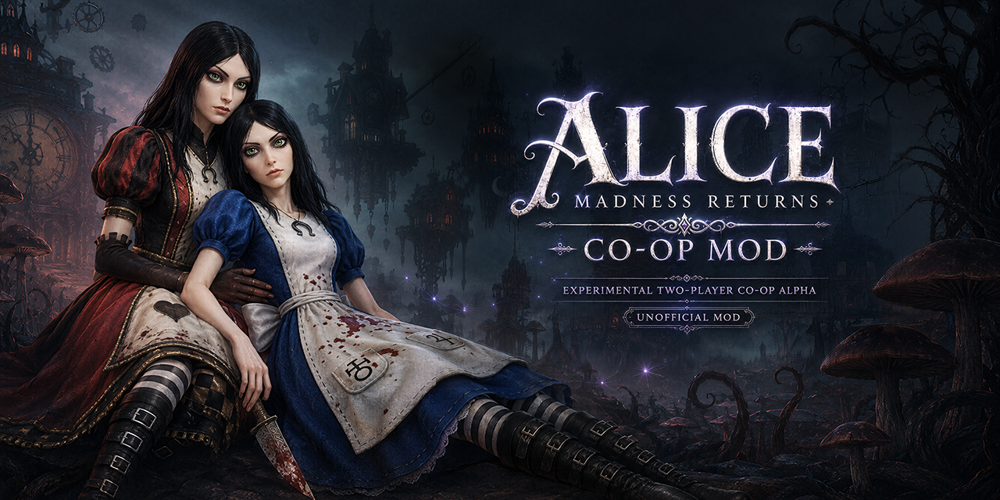
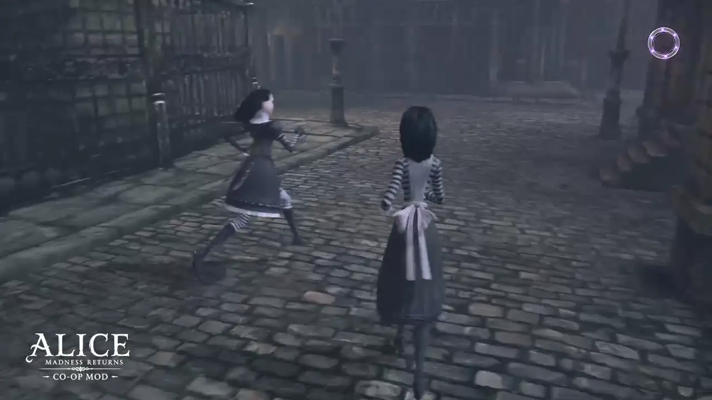

# Alice Co-op



<p align="center">
  <strong><a href="https://www.youtube.com/watch?v=QO0yarqS1-k">▶ WATCH THE FULL RELEASE TRAILER ON YOUTUBE</a></strong>
</p>

[Русская версия](README_RU.md) · [Installation](docs/INSTALL.md) ·
[Known issues](docs/KNOWN_ISSUES.md) · [GPL-2.0](LICENSE)

Alice Co-op is an experimental two-player cooperative mod for the Windows version
of *Alice: Madness Returns*. Each player runs their own game process; a small UDP
relay exchanges player, animation and world state while the host provides the
authoritative view of ordinary enemies.

> [!WARNING]
> This is an alpha playtest build. Back up your saves, use a dedicated co-op
> profile, and expect occasional checkpoint restarts or manual recovery in
> heavily scripted encounters.

## Gameplay preview



*Actual in-game footage from the current alpha build. The header is unofficial
promotional artwork containing AI-generated elements.*

## What currently works

- Host and client can see and independently control their own Alice.
- Remote movement, jumping, gliding, shrinking, dodging, several attacks,
  equipped weapons, hair, dress and major presentation effects are represented.
- Ordinary enemies share host-authoritative position, health and death state.
- Enemies can change focus between the host and client, and damage both players.
- Many breakable props are destroyed for both players while loot remains local.
- Shared death, checkpoint restart and return to the main menu are coordinated.
- Common interaction cinematics and trigger cutscenes can be synchronized.
- The client can join the host checkpoint and optionally copy the host profile
  after an explicit destructive warning and integrity verification.
- Emergency teleports and a force-cutscene action recover many soft desyncs.

This is not native Unreal Engine 3 networking. Both games still simulate parts
of the level locally, and Alice Co-op reconciles the pieces that are practical to
identify safely at runtime.

## Requirements

- A legitimate PC installation of *Alice: Madness Returns* (Steam or EA App).
- Windows 10 or Windows 11, 64-bit OS; the game and mod are 32-bit.
- The Microsoft Visual C++ 2015–2022 Redistributable **x86**.
- The exact same Alice Co-op release on both computers.
- Localhost, a trusted LAN, or a trusted VPN such as Radmin VPN.

Alice Co-op includes a combined client DLL based on
[MadnessPatch 3.1.1](https://github.com/Wemino/MadnessPatch/releases/tag/3.1.1).
A separate MadnessPatch installation is not required.

## Quick start

1. Close the game on both computers.
2. Download the latest `AliceCoop-*-drop-in.zip` from
   [Releases](https://github.com/docwitson/Alice-Madness-Returns-Co-op/releases).
3. Extract the archive into the folder containing `AliceMadnessReturns.exe`:

   ```text
   <game>\Binaries\Win32
   ```

4. Open `AliceCoop\AliceCoop-LaunchConfig.bat` and set `SERVER_IP` to the IP of
   the computer that will run `AliceCoopServer.exe`. Use `127.0.0.1` for a local
   two-window test.
5. On the server/host computer, run:

   ```text
   AliceCoop\AliceCoop-Server.bat
   AliceCoop\AliceCoop-Host.bat
   ```

6. On the other computer, run:

   ```text
   AliceCoop\AliceCoop-Client.bat
   ```

7. Load compatible profiles. The client can use `SYNC HOST SAVE` in the main
   menu to copy the host's progression; read the warning carefully.
8. Enter gameplay. If joining through the overlay loads the correct level but
   not the host's exact position, press `O` once after the level has loaded.

The relay server may run on either player's computer. Allow inbound UDP traffic
for its configured port (default `27018`). Do not expose it directly to the
public Internet: the prototype protocol has no authentication or encryption.

See the full [installation and update guide](docs/INSTALL.md).

## Controls

| Key | Context | Action |
| --- | --- | --- |
| `P` | Gameplay | Safe teleport: client to host; host to client |
| `O` | Client gameplay | Forced teleport to the host without the distance safety check |
| `L` | Yellow action visible | Join the host checkpoint or force a waiting cutscene |
| `K` | Client main menu | Open host-profile synchronization warning |
| `T` | Pause menu | Toggle bounded proxy movement-trail history |

The normal game keeps ownership of these keys outside the listed contexts.

## Configuration

Normal launch settings live in:

```text
AliceCoop\AliceCoop-LaunchConfig.bat
```

Network, proxy, synchronization and diagnostic settings live in:

```text
AliceCoop\AliceCoop.ini
```

MadnessPatch settings remain in `MadnessPatch.ini` next to the game executable.
See [docs/CONFIGURATION.md](docs/CONFIGURATION.md).

## Known limitations

- Some bosses and scripted waves can desynchronize between game processes.
- Certain switches, pig snouts, moving platforms and secret rooms remain local.
- Remote animation, upper-body aiming, hair, rigid dress and particles are
  approximated and can differ from the owning player's view.
- The hat bomb proxy does not reproduce every original animation detail.
- Cutscene barriers are heuristic; use the yellow force action only when both
  players are genuinely stuck.
- The side-scrolling ship stages intentionally run independently in solo mode.
- Host profile synchronization overwrites the selected client profile.

Read the complete [known-issues and recovery guide](docs/KNOWN_ISSUES.md).

## Building from source

Open `AliceCoop.sln` in Visual Studio 2022 and build `Release|x86`, or run:

```powershell
& .\tools\Build-AliceCoop-Package.ps1
```

The build requires the Visual Studio C++ workload and Windows 10/11 SDK. Build
outputs and release archives are intentionally ignored by Git. See
[docs/DEVELOPMENT.md](docs/DEVELOPMENT.md).

## Project status and support

Alice Co-op is community research and remains an alpha. When reporting a problem,
include the map/checkpoint, which player triggered the event, reproduction steps,
and the relevant host/client logs after removing personal paths and addresses.

## Credits and license

Alice Co-op is based on [MadnessPatch](https://github.com/Wemino/MadnessPatch) by
Wemino and contributors.

The combined work is distributed under the
[GNU General Public License version 2.0](LICENSE). See [NOTICE.md](NOTICE.md) and
[THIRD_PARTY_NOTICES.md](THIRD_PARTY_NOTICES.md).

This project is unofficial and is not affiliated with or endorsed by Electronic
Arts, Spicy Horse, Epic Games, or the MadnessPatch project. No retail game files
are included.
